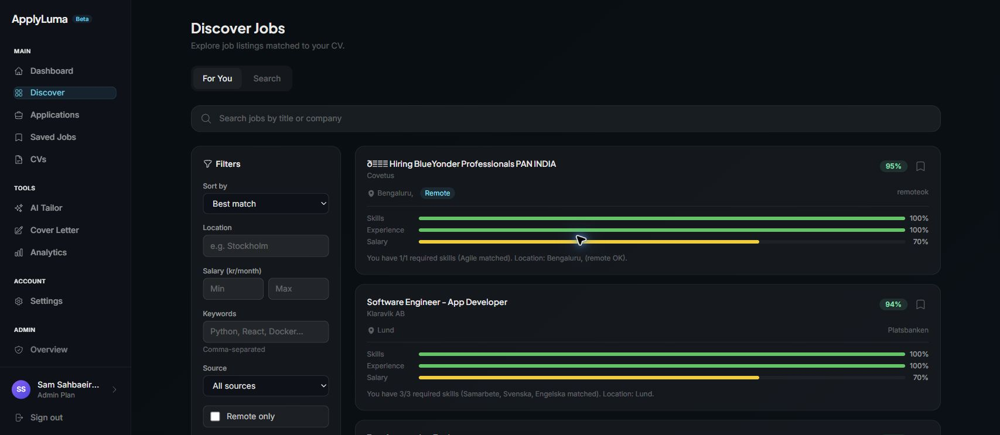
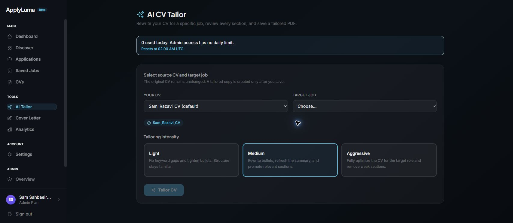
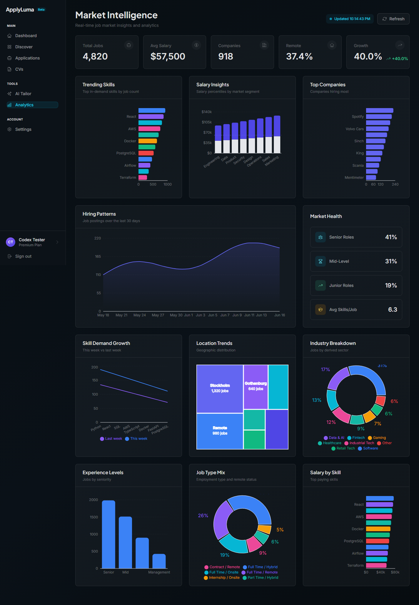
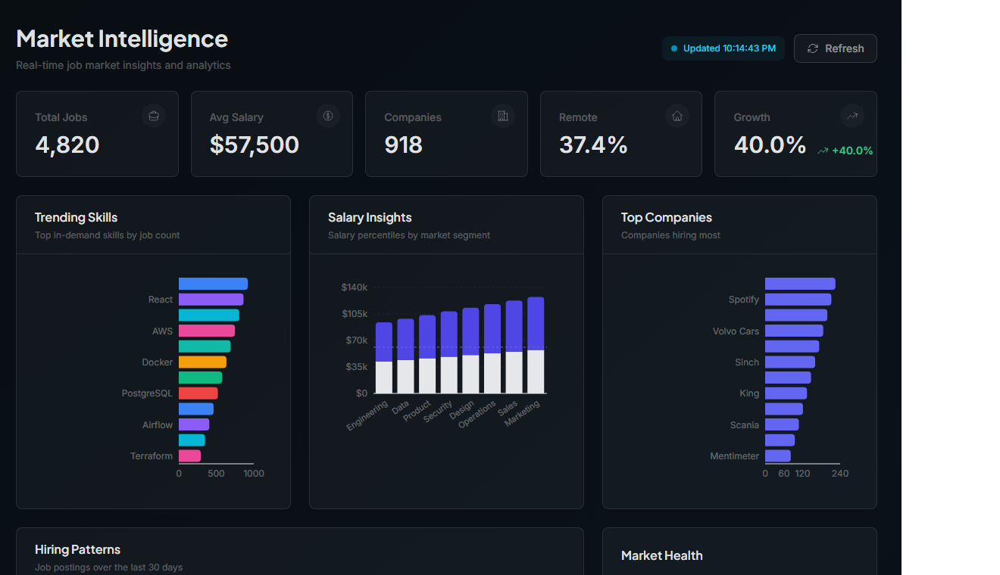
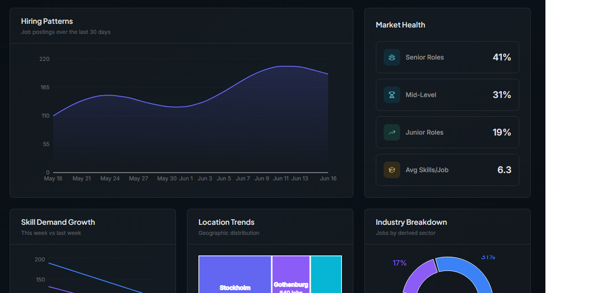
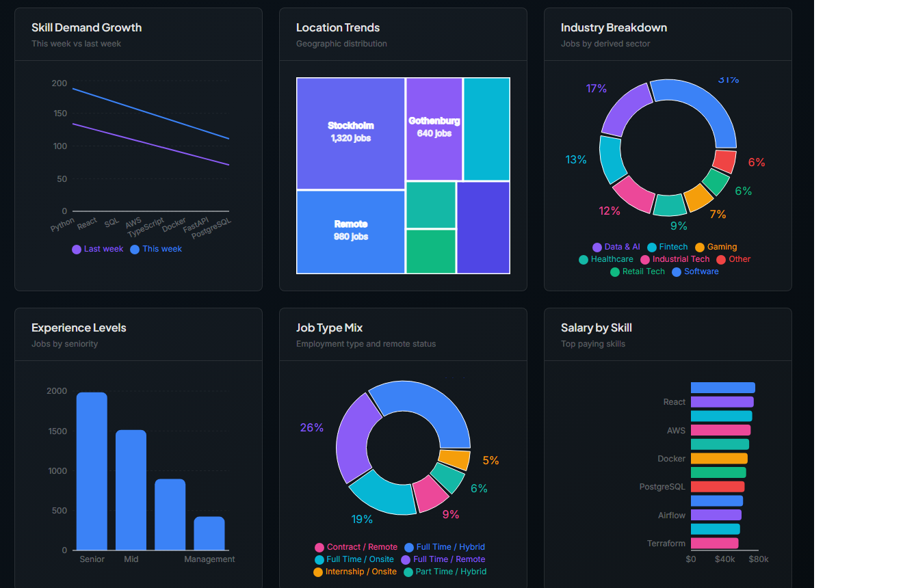
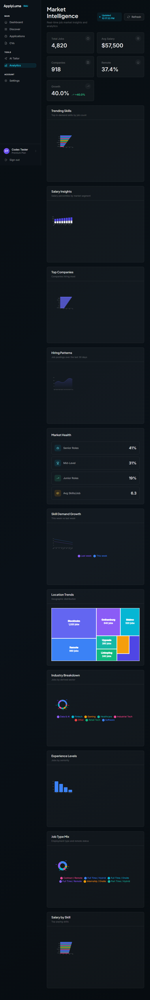
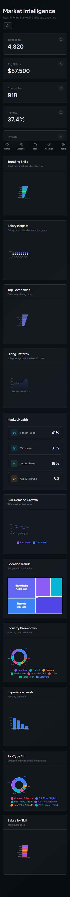

# ApplyLuma

[](https://github.com/sam-razavi/applyluma/actions/workflows/ci.yml)
[](https://github.com/sam-razavi/applyluma/actions/workflows/data-pipeline-tests.yml)
[](https://railway.app)
[](https://applyluma.com)
[](https://github.com/Sam-Razavi/applyluma/commits/main)
[](https://www.python.org/)
[](https://nodejs.org/)

ApplyLuma is a production-deployed AI job-search platform that helps candidates discover matched jobs, tailor CVs, generate cover letters, track applications, and analyze job-market trends from one workspace.

- Production: https://applyluma.com
- Backend API: https://applyluma-production.up.railway.app
- API docs: https://applyluma-production.up.railway.app/docs
- Browser extension: `applyluma-extension/`

## Product Preview

### Job Discovery and AI CV Tailoring

| AI-matched job discovery | AI CV tailoring workflow |
| --- | --- |
|  |  |

### Market Intelligence Dashboard



### Analytics Details

| Market KPIs and demand signals | Hiring trend and market health |
| --- | --- |
|  |  |

### Breakdowns and Responsive Layouts

| Market breakdowns | Tablet | Mobile |
| --- | --- | --- |
|  |  |  |

## Why This Project Matters

ApplyLuma is built like a real SaaS product rather than a demo app. It combines:

- Full-stack product delivery: React, TypeScript, FastAPI, PostgreSQL, Redis, Celery, Docker, Railway, and Vercel.
- AI workflows: resume analysis, section-by-section CV tailoring, cover letter generation, job URL extraction, and match-score explanation.
- Data engineering: scheduled job ingestion, dbt transformations, analytics APIs, and a production dashboard.
- Security and operations: httpOnly cookie auth, CSRF protection, token denylist, rate limits, SSRF protection, admin audit logging, CI, and deployment docs.
- Recruiter-visible product thinking: responsive UI, onboarding flows, job tracking, billing plans, alert preferences, and browser extension support.

## Core Features

### Candidate Workspace

- Secure sign-up, login, password reset, email verification, and session handling.
- CV upload (PDF, DOCX, and Markdown), parsing, AI analysis, version history, and authenticated PDF downloads.
- AI CV Tailor with asynchronous processing, section review, save, and export.
- Cover Letter Generator with formal, friendly, and concise tones.
- Job description manager with URL scraping for publicly accessible job posts.
- Application tracker with status history, contact notes, timeline, and analytics.
- Email/password and Google OAuth sign-in, in-app notification center, and Stripe billing (checkout, customer portal, webhooks) for the premium plan.

### Job Discovery

- Swedish job discovery from Platsbanken, Jobbsafari, and Indeed.se integrations.
- International job search through Adzuna.
- AI match scoring against the user's CV with matched and missing skill breakdowns.
- Saved jobs with collections, starring, notes, and detail views.
- One-click actions from discovered jobs: tailor CV, save job, and add to applications.
- Job alert emails for high-match roles with configurable threshold and frequency.

### Analytics and Admin

- Market intelligence dashboard for job volume, salary bands, remote share, growth, top companies, skills, location, seniority, and job-type mix.
- Resume-vs-market comparison for authenticated users with uploaded CVs.
- Admin panel covering user management (activity timeline, delete/password-reset/verify, per-user AI cost and tailor-limit overrides), AI job monitoring with cost/budget tracking, billing overview, contact/feedback inbox, notification center, raw job postings, database table stats, audit logs, and pipeline health.
- Daily scraping and transform pipeline backed by Airflow, dbt, PostgreSQL, and Redis caching.
- Three-layer monitoring (external uptime pinger, internal health watchdog, Sentry) — see [docs/MONITORING.md](docs/MONITORING.md).

### Browser Extension

- Manifest V3 Chrome/Firefox extension in `applyluma-extension/`.
- One-click save from LinkedIn, Indeed, Glassdoor, and Arbetsformedlingen job pages.
- Badge state for saved/applied URLs and `Alt+Shift+S` quick-save.
- Bearer-token extension auth flow through `/extension-auth`.

## Tech Stack

| Area | Tools |
| --- | --- |
| Frontend | React, TypeScript, Vite, Tailwind CSS, Framer Motion, Zustand, Recharts |
| Backend | FastAPI, SQLAlchemy, Alembic, PostgreSQL, Redis, Celery |
| AI | OpenAI API for resume analysis, CV tailoring, cover letters, extraction, and scoring |
| Data | Apache Airflow on Astro Cloud, dbt, Railway PostgreSQL |
| Extension | Manifest V3, content scripts, Chrome/Firefox storage APIs |
| Infrastructure | Railway, Vercel, Docker, Namecheap DNS |
| Payments and Email | Stripe, Resend |
| Quality | Pytest, Vitest, GitHub Actions, ruff, type checks |

## Architecture

```text
applyluma/
|-- backend/               FastAPI API, SQLAlchemy models, schemas, services, tasks, tests
|-- frontend/              React + TypeScript app, pages, components, stores, tests
|-- applyluma-extension/   MV3 browser extension for saving jobs from job boards
|-- airflow/               DAGs for scraping, keyword extraction, and scoring jobs
|-- dbt/                   Analytics transformations
|-- deployment/            Railway, Vercel, DNS, Airflow, and test checklists
|-- docs/                  Product and technical documentation
`-- graphify-out/          Local knowledge graph for codebase navigation
```

## Production Deployment

- Frontend: Vercel, https://applyluma.com
- Backend: Railway, https://applyluma-production.up.railway.app
- Database: Railway PostgreSQL
- Cache and queue broker: Railway Redis
- Data pipeline: Astro Cloud Airflow plus dbt
- Domain: Namecheap DNS pointing to Vercel

`main` is the production branch and auto-deploys to Railway and Vercel. Railway runs `alembic upgrade head` before starting the backend container.

Deployment guides:

- [Railway Backend Setup](deployment/RAILWAY_SETUP.md)
- [Vercel Frontend Setup](deployment/VERCEL_SETUP.md)
- [DNS Configuration](deployment/DNS_SETUP.md)
- [Airflow Remote Connection](deployment/AIRFLOW_REMOTE.md)
- [Testing Checklist](deployment/TESTING_CHECKLIST.md)

## Local Development

Prerequisites:

- Docker Desktop
- Node.js 22+
- Python 3.11+
- Git

Start the full local stack:

```bash
docker-compose up
```

Local URLs:

- Frontend: http://localhost:5173
- Backend API: http://localhost:8000
- API docs: http://localhost:8000/docs

Manual backend setup:

```bash
cd backend
pip install uv
uv pip install -e ".[dev]" --system
alembic upgrade head
uvicorn app.main:app --reload
```

Manual frontend setup:

```bash
cd frontend
npm install
npm run dev
```

## Testing

ApplyLuma ships with **832 automated tests** across the stack, all run in CI on every push and pull request to `main` and `dev`.

| Suite | Tests | Coverage |
| --- | --- | --- |
| Backend — Pytest (async, ASGI transport) | 570 across 45 files | API endpoints, CRUD, services (CV parsing, AI tailoring, cover letters, match scoring, billing), Celery tasks (incl. the health watchdog), admin controls, auth and security |
| Frontend — Vitest + React Testing Library | 245 across 29 files | Pages, Zustand stores, components, and formatters |
| Airflow — Pytest | 10 across 2 files | DAG integrity (load, cycles, required params) and DAG logic |
| dbt | 7 SQL assertions + `dbt parse` | Data-quality assertions and project validation |

```bash
# Backend — lint, type-check, test
cd backend && ruff check app/ && mypy app/ && python -m pytest

# Frontend — lint, type-check, test, build
cd frontend && npm run lint && npm run type-check && npm test && npm run build

# Airflow DAG integrity
PYTHONPATH=$(pwd)/airflow/dags:$(pwd)/airflow/plugins pytest airflow/tests/

# dbt project validation
cd dbt && dbt deps --profiles-dir . && dbt parse --profiles-dir .
```

## Data Pipeline

ApplyLuma uses Astro Cloud for managed Airflow scheduling. DAG code remains in `airflow/dags/`, while production runs on Astronomer-managed infrastructure.

Schedule:

- Job scraping: daily at 02:00 UTC
- dbt transforms: daily at 03:00 UTC
- Keyword extraction and match-score computation: daily at 03:30 UTC

Production health check:

```bash
curl https://applyluma-production.up.railway.app/api/v1/analytics/job-market-health
```

## Environment Variables

Backend variables are configured in Railway. Frontend variables are configured in Vercel.

Key backend variables:

- `PORT=8080`
- `DATABASE_URL`
- `REDIS_URL`
- `SECRET_KEY`
- `OPENAI_API_KEY`
- `ADZUNA_APP_ID`
- `ADZUNA_API_KEY`
- `STRIPE_SECRET_KEY`
- `STRIPE_WEBHOOK_SECRET`
- `STRIPE_PREMIUM_PRICE_ID`
- `RESEND_API_KEY`
- `SENTRY_DSN`
- `ENVIRONMENT=production`

Key frontend variables:

- `VITE_API_URL`
- `VITE_POSTHOG_KEY`
- `VITE_POSTHOG_HOST`
- `VITE_SENTRY_DSN`

Never commit real secrets or production `.env` files.

## Current Limitations

- The Discover feed depends on scheduled ingestion, so new jobs can take up to 24 hours to appear.
- AI features require a configured OpenAI API key.
- Match scoring requires at least one uploaded CV.
- Free-tier users have daily limits for CV tailoring and cover-letter generation.
- Job URL scraping works best on public pages without login walls or heavy anti-bot protection.
- Transactional email requires a configured Resend API key and verified sending domain.
- Redis is required for async jobs, match-score caching, job-feed caching, and token denylisting.
- ApplyLuma is a responsive web application; there is no native mobile app.

## License

MIT
